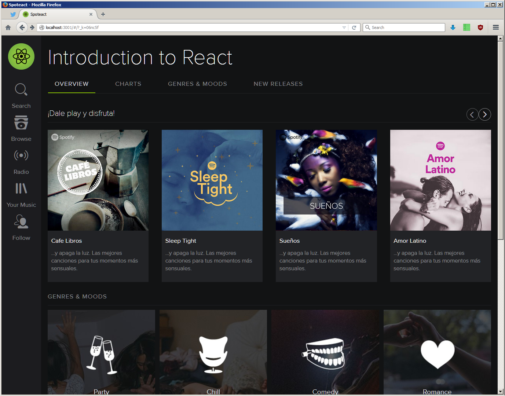

# Spoteact

React fork of [iranreyes/spotyngular](https://github.com/iranreyes/spotyngular)

## How to install

Just clone the project and execute:

`npm install` to install all the npm packages

then `npm start` will start two servers, one for our database and another for the site itself.
